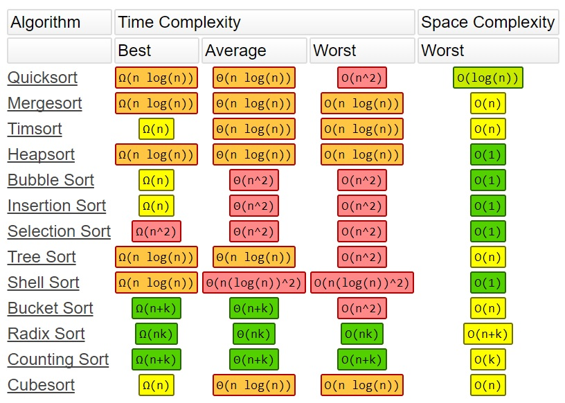

## Algorithm Complexity (Kompleksitas Algorithma)


### Pengertian
Kompleksitas Algoritma ialah mengacu pada benyaknya sumber/resource(seperti memori) dibutuhkan algoritma untuk menyelesaikan sebuah masalah. Istilah umumnya ***Time Complexity*** mengacu pada lamanya waktu berjalan sebuah algoritma. ***Space Complexity*** termasuk dalam kompleksitas algoritma, yaitu benyakknya sumber daya/resource yang diperlukan oleh algoritma untuk berkerja. Dengan mencari kompleksitas algoritma maka akan didapat algoritma yang paling **efisien, cepat dan ringan**. Jenis notasi asimtotik untuk kompleksitas:

> - **Worst-case: Big-O | O(n)**
> - **Average-case: Big-Theta | Θ(n)**
> - **Best-case: Big-Omega | Ω(n)**

### Best-case (Kasus terbaik)
Mendefinisikan kasus terbaik dari kompleksitas waktu sebuah algoritma, untuk kasus ini jumlah waktu minimal sebuah algoritma berkerja.

### Average-case (Kasus rata-rata)
Mendefinisikan kasus rata-rata dari kompleksitas waktu sebuah algoritma, untuk kasus ini jumlah waktu rata-rata sebuah algoritma berkerja.

### Worst-case (Kasus terburuk)
Mendefinisikan kasus terburuk dari kompleksitas waktu sebuah algoritma, untuk kasus ini jumlah waktu maksimal sebuah algoritma berkerja.

### Daftar kompleksitas dari Struktur Data


### Daftar kompleksitas dari beberapa Algoritma


### Jenis Runtime Algoritma
Untuk jenis-jenis runtime/waktu berjalan sebuah algoritma:

- **constant: Θ(1)**
- **logarithmic: Θ(log N)**
- **linear: Θ(N)**
- **polynomial: Θ(N^2)**
- **exponential: Θ(2^N)**
- **factorial: Θ(N!)**


### Asymptotic Notations atau Big-O
Notasi Asimtotik adalah adalah notasi matematika untuk menggambarkan waktu berkerja suatu algoritma ketika input menuju nilai tertentu atau nilai pembatas.

### Menentukan Kompleksitas Sebuah Algoritma
Contoh menentukan kompleksitas dari sebuah algoritma, contoh dengan kode program **Java**.

#### 1. Konstant: O(1)
Dimana sebuah algoritma berjalan tetap (Time & Space). Umumnya nilai input tetap dan terdapat batas/limit.
```Java
double number = 123; // O(1), Contant time
```
Untuk setiap kompleksitas dari 1 pernyataan + pernyataan lain.
```Java
public class ConstantExam {
	public static void main(String... args) {
		double num1 = 100; // O(1)
		double num2 = 200; // O(1)

		System.out.println("Sum: "+num1+num2); // O(1)

		// Time Complexity: O(1) + O(1) + O(1) = O(3) atau O(1)
		// Space Complexity: karena ada 2 nilai yang diproses maka O(2)
	}
}
```
#### 2. Logaritma: O(log n)
Kondisi dimana sebuah algoritma berjalan secara naik turun, algoritma pada kasus ini umumnya memecah masalah menjadi sub-masalah sehingga tidak terlalu berat untuk memproses, contoh Binary Search. 


Terdapat array dengan jumlah 8, maka 2^3 = 8 jadi terjadi 3 kali operasi yang dijalankan sebuah algoritma untuk mencari nilai 2.